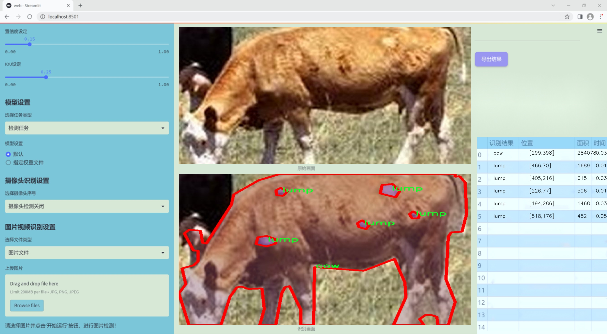
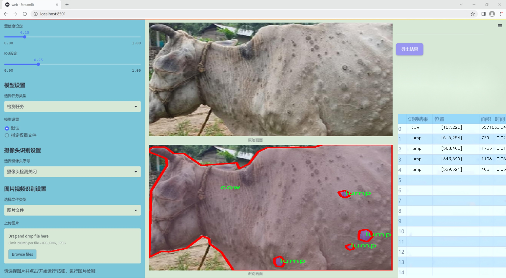
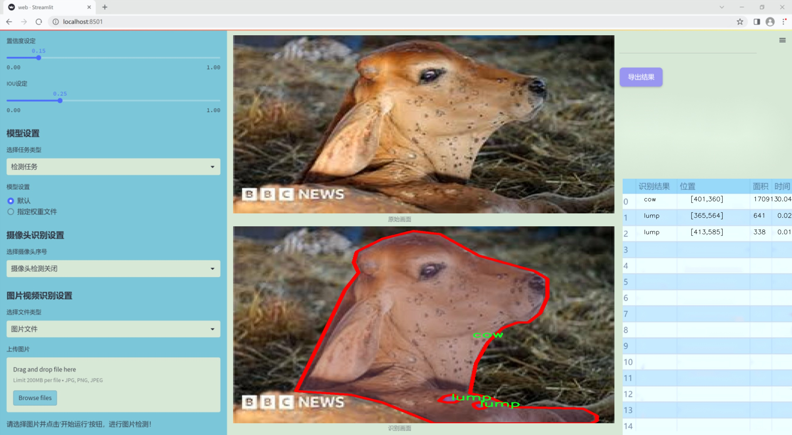
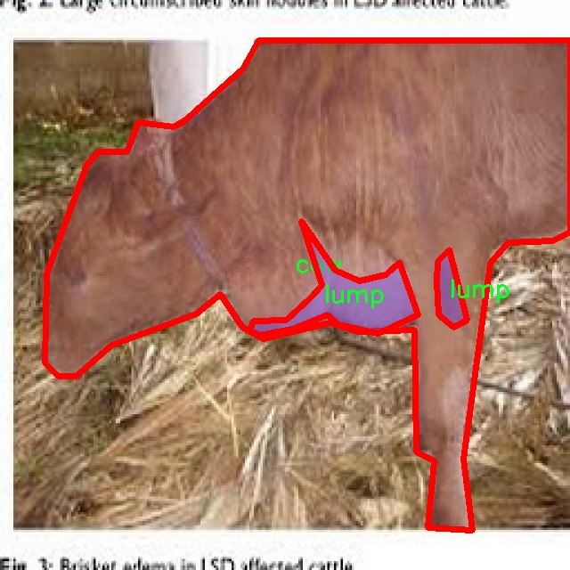
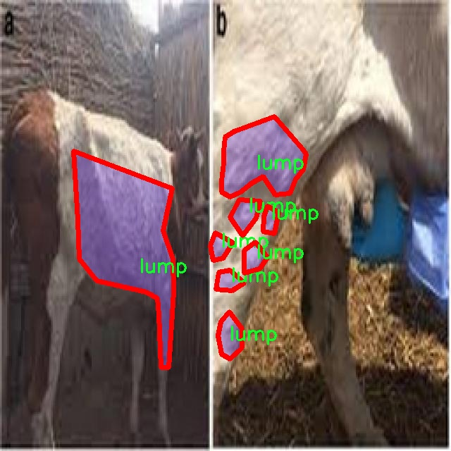
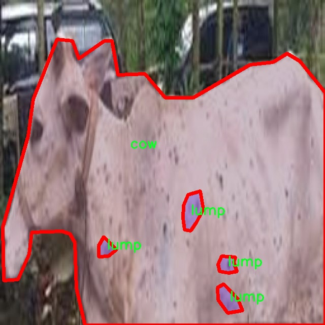
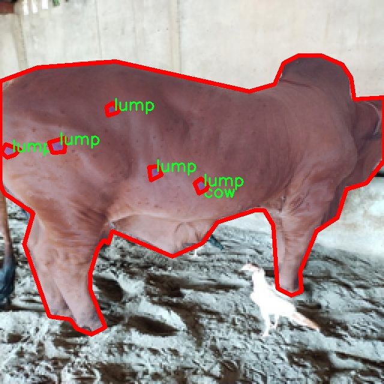
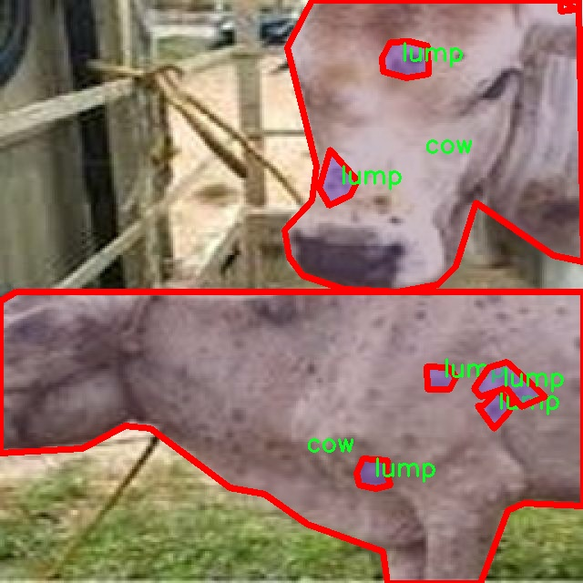

### 1.背景意义

研究背景与意义

牛结节性皮肤病是一种影响牛只健康的重要疾病，其主要特征是皮肤上出现结节或肿块。这种疾病不仅对牛只的生长和生产性能造成影响，还可能导致经济损失和食品安全隐患。因此，及时、准确地检测和诊断牛结节性皮肤病显得尤为重要。传统的检测方法往往依赖于兽医的经验和人工检查，效率低下且容易受到主观因素的影响。随着计算机视觉技术的快速发展，基于深度学习的自动化检测系统逐渐成为解决这一问题的有效手段。

本研究旨在基于改进的YOLOv11模型，构建一个高效的牛结节性皮肤病检测系统。YOLO（You Only Look Once）系列模型以其实时性和高准确率在目标检测领域取得了显著成果。通过对YOLOv11进行改进，我们希望能够进一步提升其在特定场景下的检测性能，尤其是在牛结节性皮肤病的检测任务中。我们的数据集包含278张经过标注的牛只图像，涵盖了两类目标：牛和结节。这一数据集为模型的训练和评估提供了坚实的基础。

此外，随着农业现代化的推进，数字化技术在畜牧业中的应用日益广泛。通过构建智能化的检测系统，不仅可以提高牛结节性皮肤病的检测效率，还能为养殖户提供科学的管理依据，促进健康养殖和可持续发展。因此，本研究不仅具有重要的学术价值，也具有广泛的应用前景，能够为提高畜牧业的生产效率和动物福利做出贡献。

### 2.视频效果

[2.1 视频效果](https://www.bilibili.com/video/BV1r4mxYTE1q/)

### 3.图片效果







##### [项目涉及的源码数据来源链接](https://kdocs.cn/l/cszuIiCKVNis)**

注意：本项目提供训练的数据集和训练教程,由于版本持续更新,暂不提供权重文件（best.pt）,请按照6.训练教程进行训练后实现上图演示的效果。

### 4.数据集信息

##### 4.1 本项目数据集类别数＆类别名

nc: 2
names: ['cow', 'lump']


该项目为【图像分割】数据集，请在【训练教程和Web端加载模型教程（第三步）】这一步的时候按照【图像分割】部分的教程来训练

##### 4.2 本项目数据集信息介绍

本项目数据集信息介绍

本项目旨在改进YOLOv11模型，以实现对牛结节性皮肤病的高效检测。为此，我们构建了一个专门的数据集，旨在为模型的训练和评估提供丰富的样本和准确的标注。该数据集的主题为“annotate image”，主要包含两类目标：牛（cow）和肿块（lump）。在数据集中，我们精心挑选了多种场景下的牛只图像，确保覆盖不同的环境、光照条件以及牛只的姿态变化，以增强模型的泛化能力。

数据集中包含的牛只图像均经过专业的标注，确保每一张图像中的牛只和肿块都被准确识别和框定。标注过程中，我们采用了严格的质量控制措施，以确保数据的准确性和一致性。这一过程不仅包括对牛只的识别，还特别关注肿块的形态特征，力求在不同的病理状态下提供详尽的标注信息。

在类别数量方面，本数据集共设定了两个类别，分别为“cow”和“lump”。这种简化的类别设置使得模型在训练过程中能够更加专注于关键特征的学习，从而提高检测的准确性和效率。通过对这两个类别的深入学习，YOLOv11模型将能够在实际应用中快速识别出牛只及其可能存在的皮肤病变，进而为养殖业提供科学的疾病预警和管理方案。

总之，本项目的数据集不仅在数量上满足了训练需求，更在质量上力求精益求精，为改进YOLOv11的牛结节性皮肤病检测系统奠定了坚实的基础。通过这一数据集的应用，我们期待能够推动牛只健康管理的智能化进程，提高养殖效率，降低经济损失。











### 5.全套项目环境部署视频教程（零基础手把手教学）

[5.1 所需软件PyCharm和Anaconda安装教程（第一步）](https://www.bilibili.com/video/BV1BoC1YCEKi/?spm_id_from=333.999.0.0&vd_source=bc9aec86d164b67a7004b996143742dc)


[5.2 安装Python虚拟环境创建和依赖库安装视频教程（第二步）](https://www.bilibili.com/video/BV1ZoC1YCEBw?spm_id_from=333.788.videopod.sections&vd_source=bc9aec86d164b67a7004b996143742dc)

### 6.改进YOLOv11训练教程和Web_UI前端加载模型教程（零基础手把手教学）

[6.1 改进YOLOv11训练教程和Web_UI前端加载模型教程（第三步）](https://www.bilibili.com/video/BV1BoC1YCEhR?spm_id_from=333.788.videopod.sections&vd_source=bc9aec86d164b67a7004b996143742dc)


按照上面的训练视频教程链接加载项目提供的数据集，运行train.py即可开始训练



     Epoch   gpu_mem       box       obj       cls    labels  img_size
     1/200     20.8G   0.01576   0.01955  0.007536        22      1280: 100%|██████████| 849/849 [14:42<00:00,  1.04s/it]
               Class     Images     Labels          P          R     mAP@.5 mAP@.5:.95: 100%|██████████| 213/213 [01:14<00:00,  2.87it/s]
                 all       3395      17314      0.994      0.957      0.0957      0.0843

     Epoch   gpu_mem       box       obj       cls    labels  img_size
     2/200     20.8G   0.01578   0.01923  0.007006        22      1280: 100%|██████████| 849/849 [14:44<00:00,  1.04s/it]
               Class     Images     Labels          P          R     mAP@.5 mAP@.5:.95: 100%|██████████| 213/213 [01:12<00:00,  2.95it/s]
                 all       3395      17314      0.996      0.956      0.0957      0.0845

     Epoch   gpu_mem       box       obj       cls    labels  img_size
     3/200     20.8G   0.01561    0.0191  0.006895        27      1280: 100%|██████████| 849/849 [10:56<00:00,  1.29it/s]
               Class     Images     Labels          P          R     mAP@.5 mAP@.5:.95: 100%|███████   | 187/213 [00:52<00:00,  4.04it/s]
                 all       3395      17314      0.996      0.957      0.0957      0.0845


###### [项目数据集下载链接](https://kdocs.cn/l/cszuIiCKVNis)

### 7.原始YOLOv11算法讲解

##### YOLO11简介

> YOLO11源码地址：https://github.com/ultralytics/ultralytics

Ultralytics
YOLO11是一款尖端的、最先进的模型，它在之前YOLO版本成功的基础上进行了构建，并引入了新功能和改进，以进一步提升性能和灵活性。YOLO11设计快速、准确且易于使用，使其成为各种物体检测和跟踪、实例分割、图像分类以及姿态估计任务的绝佳选择。  


**YOLO11创新点如下:**

YOLO 11主要改进包括：  
`增强的特征提取`：YOLO 11采用了改进的骨干和颈部架构，增强了特征提取功能，以实现更精确的目标检测。  
`优化的效率和速度`：优化的架构设计和优化的训练管道提供更快的处理速度，同时保持准确性和性能之间的平衡。  
`更高的精度，更少的参数`：YOLO11m在COCO数据集上实现了更高的平均精度（mAP），参数比YOLOv8m少22%，使其在不影响精度的情况下提高了计算效率。  
`跨环境的适应性`：YOLO 11可以部署在各种环境中，包括边缘设备、云平台和支持NVIDIA GPU的系统。  
`广泛的支持任务`：YOLO 11支持各种计算机视觉任务，如对象检测、实例分割、图像分类、姿态估计和面向对象检测（OBB）。

**YOLO11不同模型尺寸信息：**

YOLO11 提供5种不同的型号规模模型，以满足不同的应用需求：

Model| size (pixels)| mAPval 50-95| Speed CPU ONNX (ms)| Speed T4 TensorRT10
(ms)| params (M)| FLOPs (B)  
---|---|---|---|---|---|---  
YOLO11n| 640| 39.5| 56.1 ± 0.8| 1.5 ± 0.0| 2.6| 6.5  
YOLO11s| 640| 47.0| 90.0 ± 1.2| 2.5 ± 0.0| 9.4| 21.5  
YOLO11m| 640| 51.5| 183.2 ± 2.0| 4.7 ± 0.1| 20.1| 68.0  
YOLO11l| 640| 53.4| 238.6 ± 1.4| 6.2 ± 0.1| 25.3| 86.9  
YOLO11x| 640| 54.7| 462.8 ± 6.7| 11.3 ± 0.2| 56.9| 194.9  
  
**模型常用训练超参数参数说明：**  
`YOLOv11
模型的训练设置包括训练过程中使用的各种超参数和配置`。这些设置会影响模型的性能、速度和准确性。关键的训练设置包括批量大小、学习率、动量和权重衰减。此外，优化器、损失函数和训练数据集组成的选择也会影响训练过程。对这些设置进行仔细的调整和实验对于优化性能至关重要。  
**以下是一些常用的模型训练参数和说明：**

参数名| 默认值| 说明  
---|---|---  
`model`| `None`| 指定用于训练的模型文件。接受指向 `.pt` 预训练模型或 `.yaml`
配置文件。对于定义模型结构或初始化权重至关重要。  
`data`| `None`| 数据集配置文件的路径（例如
`coco8.yaml`).该文件包含特定于数据集的参数，包括训练数据和验证数据的路径、类名和类数。  
`epochs`| `100`| 训练总轮数。每个epoch代表对整个数据集进行一次完整的训练。调整该值会影响训练时间和模型性能。  
`patience`| `100`| 在验证指标没有改善的情况下，提前停止训练所需的epoch数。当性能趋于平稳时停止训练，有助于防止过度拟合。  
`batch`| `16`| 批量大小，有三种模式:设置为整数(例如，’ Batch =16 ‘)， 60% GPU内存利用率的自动模式(’ Batch
=-1 ‘)，或指定利用率分数的自动模式(’ Batch =0.70 ')。  
`imgsz`| `640`| 用于训练的目标图像尺寸。所有图像在输入模型前都会被调整到这一尺寸。影响模型精度和计算复杂度。  
`device`| `None`| 指定用于训练的计算设备：单个 GPU (`device=0`）、多个 GPU (`device=0,1`)、CPU
(`device=cpu`)，或苹果芯片的 MPS (`device=mps`).  
`workers`| `8`| 加载数据的工作线程数（每 `RANK` 多 GPU 训练）。影响数据预处理和输入模型的速度，尤其适用于多 GPU 设置。  
`name`| `None`| 训练运行的名称。用于在项目文件夹内创建一个子目录，用于存储训练日志和输出结果。  
`pretrained`| `True`| 决定是否从预处理模型开始训练。可以是布尔值，也可以是加载权重的特定模型的字符串路径。提高训练效率和模型性能。  
`optimizer`| `'auto'`| 为训练模型选择优化器。选项包括 `SGD`, `Adam`, `AdamW`, `NAdam`,
`RAdam`, `RMSProp` 等，或 `auto` 用于根据模型配置进行自动选择。影响收敛速度和稳定性  
`lr0`| `0.01`| 初始学习率（即 `SGD=1E-2`, `Adam=1E-3`) .调整这个值对优化过程至关重要，会影响模型权重的更新速度。  
`lrf`| `0.01`| 最终学习率占初始学习率的百分比 = (`lr0 * lrf`)，与调度程序结合使用，随着时间的推移调整学习率。  


**各损失函数作用说明：**  
`定位损失box_loss`：预测框与标定框之间的误差（GIoU），越小定位得越准；  
`分类损失cls_loss`：计算锚框与对应的标定分类是否正确，越小分类得越准；  
`动态特征损失（dfl_loss）`：DFLLoss是一种用于回归预测框与目标框之间距离的损失函数。在计算损失时，目标框需要缩放到特征图尺度，即除以相应的stride，并与预测的边界框计算Ciou
Loss，同时与预测的anchors中心点到各边的距离计算回归DFLLoss。  


### 8.200+种全套改进YOLOV11创新点原理讲解

#### 8.1 200+种全套改进YOLOV11创新点原理讲解大全

由于篇幅限制，每个创新点的具体原理讲解就不全部展开，具体见下列网址中的改进模块对应项目的技术原理博客网址【Blog】（创新点均为模块化搭建，原理适配YOLOv5~YOLOv11等各种版本）

[改进模块技术原理博客【Blog】网址链接](https://gitee.com/qunmasj/good)


#### 8.2 精选部分改进YOLOV11创新点原理讲解

###### 这里节选部分改进创新点展开原理讲解(完整的改进原理见上图和[改进模块技术原理博客链接](https://gitee.com/qunmasj/good)【如果此小节的图加载失败可以通过CSDN或者Github搜索该博客的标题访问原始博客，原始博客图片显示正常】


### Context_Grided_Network(CGNet)简介
参考该博客提出的一种轻量化语义分割模型Context Grided Network(CGNet)，以满足设备的运行需要。

CGNet主要由CG块构建而成，CG块可以学习局部特征和周围环境上下文的联合特征，最后通过引入全局上下文特征进一步改善联合特征的学习。


 
下图给出了在Cityscapes数据集上对现有的一些语义分割模型的测试效果，横轴表示参数量，纵轴表示准确率(mIoU)。可以看出，在参数量较少的情况下，CGNet可以达到一个比较好的准确率。虽与高精度模型相去甚远，但在一些对精度要求不高、对实时性要求比较苛刻的情况下，很有价值。


高精度模型，如DeepLab、DFN、DenseASPP等，动不动就是几十M的参数，很难应用在移动设备上。而上图中红色的模型，相对内存占用较小，但它们的分割精度却不是很高。作者认为主要原因是，这些小网络大多遵循着分类网络的设计思路，并没有考虑语义分割任务更深层次的特点。

空间依赖性和上下文信息对提高分割精度有很大的作用。作者从该角度出发，提出了CG block，并进一步搭建了轻量级语义分割网络CGNet。CG块具有以下特点： 

学习局部特征和上下文特征的联合特征；
通过全局上下文特征改进上述联合特征；
可以贯穿应用在整个网络中，从low level（空间级别）到high level（语义级别）。不像PSPNet、DFN、DenseASPP等，只在编码阶段以后捕捉上下文特征。；
只有3个下采样，相比一般5个下采样的网络，能够更好地保留边缘信息。
CGNet遵循“深而薄”的原则设计，整个网络又51层构成。其中，为了降低计算，大量使用了channel-wise conv.

小型语义分割模型：

需要平衡准确率和系统开销
进化路线：ENet -> ICNet -> ESPNet
这些模型基本都基于分类网络设计，在分割准确率上效果并不是很好
上下文信息模型：

大多数现有模型只考虑解码阶段的上下文信息并且没有利用周围的上下文信息
注意力机制：

CG block使用全局上下文信息计算权重向量，并使用其细化局部特征和周围上下文特征的联合特征

#### Context Guided Block
CG block由4部分组成：


此外，CG block还采用了残差学习。文中提出了局部残差学习（LRL）和全局残差学习（GRL）两种方式。 LRL添加了从输入到联合特征提取器的连接，GRL添加了从输入到全局特征提取器的连接。从直观上来说，GRL比LRL更能促进网络中的信息传递（更像ResNet~~），后面实验部分也进行了测试，的确GRL更能提升分割精度。


CGNet的通用网络结构如下图所示，分为3个stage，第一个stage使用3个卷积层抽取特征，第二和第三个stage堆叠一定数量的CG block，具体个数可以根据情况调整。最后，通过1x1 conv得到分割结果。


下图是用于Cityscapes数据集的CGNet网络细节说明：输入尺寸为3*680*680；stage1连续使用了3个Conv-BN-PReLU组合，首个组合使用了stride=2的卷积，所以得到了1/2分辨率的feature map；stage2和stage3分别使用了多个CG block，且其中使用了不同大小的膨胀卷积核，最终分别得到了1/4和1/8的feature map。

需注意：

stage2&3的输入特征分别由其上一个stage的首个和最后一个block组合给出（参考上图的绿色箭头）；

输入注入机制，图中未体现，实际使用中，作者还将输入图像下采样1/4或1/8，分别给到stage2和stage3的输入中 ，以进一步加强特征传递。

channel-wise conv。为了缩减参数数量，在局部特征提取器和周围上下文特征提取器中使用了channel-wise卷积，可以消除跨通道的计算成本，同时节省内存占用。但是，没有像MobileNet等模型一样，在depth-wise卷积后面接point-wise卷积（1*1 conv），作者解释是，因为CG block需要保持局部特征和周围上下文特征的独立性，而1*1 conv会破坏这种独立性，所以效果欠佳，实验部分也进行了验证。

个人感觉此处应该指的是depth-wise卷积？

官方Git中对该部分的实现如下：


### 9.系统功能展示

图9.1.系统支持检测结果表格显示

  图9.2.系统支持置信度和IOU阈值手动调节

  图9.3.系统支持自定义加载权重文件best.pt(需要你通过步骤5中训练获得)

  图9.4.系统支持摄像头实时识别

  图9.5.系统支持图片识别

  图9.6.系统支持视频识别

  图9.7.系统支持识别结果文件自动保存

  图9.8.系统支持Excel导出检测结果数据


### 10. YOLOv11核心改进源码讲解

#### 10.1 SMPConv.py

以下是经过精简和注释的核心代码部分，保留了主要的功能和结构：

```python
import torch
import torch.nn as nn
import torch.nn.functional as F
from timm.layers import trunc_normal_

# 定义相对位置函数，用于生成卷积核的坐标
def rel_pos(kernel_size):
    tensors = [torch.linspace(-1, 1, steps=kernel_size) for _ in range(2)]
    kernel_coord = torch.stack(torch.meshgrid(*tensors), dim=-0)  # 生成网格坐标
    kernel_coord = kernel_coord.unsqueeze(0)  # 增加一个维度
    return kernel_coord

# 定义SMP卷积层
class SMPConv(nn.Module):
    def __init__(self, planes, kernel_size, n_points, stride, padding, groups):
        super().__init__()
        self.planes = planes
        self.kernel_size = kernel_size
        self.n_points = n_points
        self.init_radius = 2 * (2/kernel_size)

        # 生成卷积核坐标
        kernel_coord = rel_pos(kernel_size)
        self.register_buffer('kernel_coord', kernel_coord)

        # 初始化权重坐标
        weight_coord = torch.empty(1, n_points, 2)
        nn.init.trunc_normal_(weight_coord, std=0.2, a=-1., b=1.)
        self.weight_coord = nn.Parameter(weight_coord)

        # 初始化半径
        self.radius = nn.Parameter(torch.empty(1, n_points).unsqueeze(-1).unsqueeze(-1))
        self.radius.data.fill_(value=self.init_radius)

        # 初始化权重
        weights = torch.empty(1, planes, n_points)
        trunc_normal_(weights, std=.02)
        self.weights = nn.Parameter(weights)

    def forward(self, x):
        kernels = self.make_kernels().unsqueeze(1)  # 生成卷积核
        x = x.contiguous()
        kernels = kernels.contiguous()

        # 根据输入数据类型选择不同的卷积实现
        if x.dtype == torch.float32:
            x = _DepthWiseConv2dImplicitGEMMFP32.apply(x, kernels)
        elif x.dtype == torch.float16:
            x = _DepthWiseConv2dImplicitGEMMFP16.apply(x, kernels)
        else:
            raise TypeError("Only support fp32 and fp16, get {}".format(x.dtype))
        return x        

    def make_kernels(self):
        # 计算卷积核
        diff = self.weight_coord.unsqueeze(-2) - self.kernel_coord.reshape(1, 2, -1).transpose(1, 2)  # 计算差值
        diff = diff.transpose(2, 3).reshape(1, self.n_points, 2, self.kernel_size, self.kernel_size)
        diff = F.relu(1 - torch.sum(torch.abs(diff), dim=2) / self.radius)  # 计算权重

        # 生成最终的卷积核
        kernels = torch.matmul(self.weights, diff.reshape(1, self.n_points, -1))  # 加权求和
        kernels = kernels.reshape(1, self.planes, *self.kernel_coord.shape[2:])  # 重新调整形状
        kernels = kernels.squeeze(0)
        kernels = torch.flip(kernels.permute(0, 2, 1), dims=(1,))  # 翻转维度
        return kernels

# 定义SMPCNN模块
class SMPCNN(nn.Module):
    def __init__(self, in_channels, out_channels, kernel_size, stride, groups, n_points=None):
        super().__init__()
        padding = kernel_size // 2
        self.smp = SMPConv(in_channels, kernel_size, n_points, stride, padding, groups)  # 使用SMP卷积
        self.small_conv = nn.Conv2d(in_channels, out_channels, kernel_size=5, stride=stride, padding=2, groups=groups, bias=False)  # 小卷积

    def forward(self, inputs):
        out = self.smp(inputs)  # 通过SMP卷积
        out += self.small_conv(inputs)  # 加上小卷积的输出
        return out

# 定义SMPBlock模块
class SMPBlock(nn.Module):
    def __init__(self, in_channels, dw_channels, lk_size, drop_path):
        super().__init__()
        self.pw1 = nn.Sequential(nn.Conv2d(in_channels, dw_channels, kernel_size=1, stride=1, padding=0), nn.BatchNorm2d(dw_channels), nn.ReLU())
        self.pw2 = nn.Conv2d(dw_channels, in_channels, kernel_size=1, stride=1, padding=0)
        self.large_kernel = SMPCNN(in_channels=dw_channels, out_channels=dw_channels, kernel_size=lk_size, stride=1, groups=dw_channels)
        self.drop_path = nn.Identity()  # 可选的DropPath

    def forward(self, x):
        out = self.pw1(x)  # 通过第一个卷积块
        out = self.large_kernel(out)  # 通过大卷积
        out = self.pw2(out)  # 通过第二个卷积块
        return x + self.drop_path(out)  # 残差连接
```

### 代码说明：
1. **rel_pos**: 生成卷积核的相对位置坐标。
2. **SMPConv**: 自定义的卷积层，支持动态生成卷积核，利用权重坐标和半径来调整卷积核的形状。
3. **SMPCNN**: 结合了SMP卷积和小卷积的模块，增强了特征提取能力。
4. **SMPBlock**: 组合多个卷积层，使用残差连接，支持DropPath功能。

这些模块构成了一个灵活的卷积神经网络架构，能够适应不同的输入和需求。

该文件 `SMPConv.py` 定义了一些用于构建深度学习模型的模块，主要包括一个自定义的卷积层 `SMPConv` 以及一些其他的辅助类和函数。以下是对代码的逐行分析和解释。

首先，文件导入了必要的库，包括 PyTorch 的核心模块和一些功能模块，如 `nn` 和 `F`。还尝试导入深度可分离卷积的实现，如果导入失败则会捕获异常。

接下来，定义了一个 `rel_pos` 函数，用于生成相对位置的坐标，这在卷积操作中可能用于计算卷积核的相对位置。

`SMPConv` 类是文件的核心部分，继承自 `nn.Module`。在初始化方法中，定义了一些参数，包括输出通道数、卷积核大小、点数、步幅和填充。使用 `rel_pos` 函数生成卷积核的坐标，并初始化权重坐标和半径。权重和半径被定义为可学习的参数。

`forward` 方法实现了前向传播逻辑。根据输入张量的类型（32位或16位浮点数），选择不同的深度可分离卷积实现进行计算。`make_kernels` 方法则负责生成卷积核，计算过程中使用了权重坐标和相对位置坐标的差异，并通过一些数学操作生成最终的卷积核。

`radius_clip` 方法用于限制半径的值在指定范围内，确保模型的稳定性。

接下来，定义了 `get_conv2d` 函数，用于根据输入参数选择使用自定义的 `SMPConv` 还是标准的 `nn.Conv2d`。如果满足特定条件，则返回 `SMPConv`，否则返回标准卷积层。

`enable_sync_bn` 和 `get_bn` 函数用于处理批归一化的选择，支持同步批归一化。

`conv_bn` 和 `conv_bn_relu` 函数则是封装了卷积层和批归一化层的组合，后者还添加了 ReLU 激活函数。

`fuse_bn` 函数用于将卷积层和批归一化层融合，以减少推理时的计算开销。

`SMPCNN` 类是一个包含多个卷积层的网络结构，它在初始化时创建了一个 `SMPConv` 和一个小卷积层。前向传播中将这两个部分的输出相加。

`SMPCNN_ConvFFN` 类实现了一个前馈网络，包含两个逐点卷积层和一个非线性激活函数。它还实现了残差连接。

最后，`SMPBlock` 类定义了一个块结构，包含逐点卷积、卷积层和非线性激活。它同样实现了残差连接，并支持 dropout。

整体来看，这个文件实现了一种新的卷积层和网络结构，结合了深度可分离卷积和自定义的卷积核生成方法，旨在提高模型的表达能力和计算效率。

#### 10.2 kacn_conv.py


这个程序文件定义了一个名为 `kacn_conv.py` 的深度学习模块，主要用于实现一种特殊的卷积层，称为 KACN（Kacn Activation Convolutional Network）卷积层。该模块使用 PyTorch 框架，包含了多个类，用于处理不同维度的卷积操作（1D、2D 和 3D）。

首先，`KACNConvNDLayer` 是一个基础类，继承自 `nn.Module`。在初始化方法中，它接受多个参数，包括卷积类型、归一化类型、输入和输出维度、卷积核大小、分组数、填充、步幅、扩张、维度数量和 dropout 比例。这个类首先会对输入参数进行验证，确保分组数为正整数，并且输入和输出维度能够被分组数整除。

接下来，该类会根据给定的归一化类型创建一个模块列表 `layer_norm`，每个分组都有一个归一化层。同时，它还会创建一个多项式卷积层 `poly_conv`，这个卷积层的输入通道数是 `(degree + 1) * input_dim // groups`，输出通道数是 `output_dim // groups`。在初始化时，卷积层的权重会使用 Kaiming 正态分布进行初始化，以便于模型训练的开始。

`forward_kacn` 方法实现了 KACN 的前向传播逻辑。它首先对输入进行激活处理，然后通过多项式卷积层进行线性变换，最后应用归一化和 dropout（如果有的话）。`forward` 方法则将输入张量按分组进行切分，依次调用 `forward_kacn` 方法处理每个分组的输入，并将结果拼接成最终的输出。

此外，文件中还定义了三个子类：`KACNConv3DLayer`、`KACNConv2DLayer` 和 `KACNConv1DLayer`，分别用于实现 3D、2D 和 1D 的 KACN 卷积层。这些子类通过调用父类 `KACNConvNDLayer` 的构造函数，传入相应的卷积和归一化类型，简化了不同维度卷积层的实现。

总的来说，这个程序文件提供了一种灵活的方式来构建 KACN 卷积层，支持多种维度的输入，并且通过分组卷积和归一化层的设计，增强了模型的表达能力和训练效果。

#### 10.2 head.py


这个程序文件 `head.py` 是一个实现 YOLOv8 检测头的 PyTorch 模块，主要用于目标检测任务。文件中定义了多个类，每个类代表不同的检测头实现，利用深度学习模型来进行物体检测。以下是对代码的详细说明：

首先，文件导入了一些必要的库，包括 `torch` 和 `torch.nn`，这些是构建神经网络的基础库。还导入了一些自定义模块和函数，例如卷积层、深度可分离卷积、动态头、特征金字塔网络等。

接下来，文件定义了多个类，主要包括 `Detect_DyHead`、`Detect_AFPN_P345`、`Detect_Efficient` 等。这些类都继承自 `nn.Module`，并实现了目标检测的不同策略。

`Detect_DyHead` 类是 YOLOv8 的检测头，使用动态头结构。其构造函数初始化了多个参数，包括类别数、隐藏通道数、块数等。`forward` 方法负责前向传播，计算出预测的边界框和类别概率。

`Detect_AFPN_P345` 类实现了带有自适应特征金字塔网络（AFPN）的检测头，适用于多层次特征融合。它的 `forward` 方法同样负责处理输入并输出检测结果。

`Detect_Efficient` 类则实现了一个高效的检测头，使用了轻量级的卷积结构，适合在资源受限的环境中使用。

文件中还定义了一些辅助类，如 `DetectAux`、`Detect_SEAM`、`Detect_MultiSEAM` 等，这些类在不同的检测场景中使用，提供了多种特征提取和处理方式。

每个检测头类都实现了 `bias_init` 方法，用于初始化偏置，以提高模型的收敛速度和准确性。此外，文件中还包含了一些特定于任务的类，如 `Segment_Efficient`、`Pose_LSCD`、`OBB_LSCD` 等，分别用于分割、姿态估计和旋转边界框检测。

最后，文件中有一些注释掉的代码和未实现的类，可能是为了后续的扩展或优化保留的。

总的来说，这个文件是 YOLOv8 目标检测模型的重要组成部分，提供了多种检测头的实现，适用于不同的应用场景。通过这些类，用户可以根据需求选择合适的检测头，进行目标检测任务。

#### 10.2 prepbn.py

以下是代码中最核心的部分，并附上详细的中文注释：

```python
import torch
import torch.nn as nn

# 定义一个自定义的批量归一化类
class RepBN(nn.Module):
    def __init__(self, channels):
        super(RepBN, self).__init__()
        # 初始化一个可学习的参数 alpha，初始值为 1
        self.alpha = nn.Parameter(torch.ones(1))
        # 初始化一个一维批量归一化层
        self.bn = nn.BatchNorm1d(channels)

    def forward(self, x):
        # 将输入张量的维度进行转置，以适应 BatchNorm1d 的输入要求
        x = x.transpose(1, 2)
        # 进行批量归一化，并加上 alpha 乘以输入 x
        x = self.bn(x) + self.alpha * x
        # 再次转置回原来的维度
        x = x.transpose(1, 2)
        return x

# 定义一个线性归一化类
class LinearNorm(nn.Module):
    def __init__(self, dim, norm1, norm2, warm=0, step=300000, r0=1.0):
        super(LinearNorm, self).__init__()
        # 注册缓冲区用于存储预热步数、当前迭代步数和总步数
        self.register_buffer('warm', torch.tensor(warm))
        self.register_buffer('iter', torch.tensor(step))
        self.register_buffer('total_step', torch.tensor(step))
        self.r0 = r0  # 初始比例
        # 初始化两个归一化层
        self.norm1 = norm1(dim)
        self.norm2 = norm2(dim)

    def forward(self, x):
        # 如果模型处于训练模式
        if self.training:
            # 如果还有预热步数
            if self.warm > 0:
                # 减少预热步数
                self.warm.copy_(self.warm - 1)
                # 使用 norm1 进行归一化
                x = self.norm1(x)
            else:
                # 计算当前的 lambda 值
                lamda = self.r0 * self.iter / self.total_step
                # 如果还有迭代步数，减少迭代步数
                if self.iter > 0:
                    self.iter.copy_(self.iter - 1)
                # 使用两个不同的归一化方法
                x1 = self.norm1(x)
                x2 = self.norm2(x)
                # 线性组合两个归一化的结果
                x = lamda * x1 + (1 - lamda) * x2
        else:
            # 如果模型处于评估模式，直接使用 norm2 进行归一化
            x = self.norm2(x)
        return x
```

### 代码说明：
1. **RepBN 类**：实现了一个自定义的批量归一化层，除了进行标准的批量归一化外，还引入了一个可学习的参数 `alpha`，用于对输入进行加权。
   
2. **LinearNorm 类**：实现了一个线性归一化层，支持在训练过程中逐步从 `norm1` 过渡到 `norm2`。它使用预热机制，在训练的初期使用 `norm1`，然后根据迭代次数动态调整使用 `norm1` 和 `norm2` 的比例。

这个程序文件 `prepbn.py` 定义了两个神经网络模块，分别是 `RepBN` 和 `LinearNorm`，它们都继承自 PyTorch 的 `nn.Module` 类，用于实现特定的归一化操作。

`RepBN` 类实现了一种改进的批量归一化（Batch Normalization）。在初始化方法中，它接受一个参数 `channels`，并创建了一个可学习的参数 `alpha`，初始值为1，以及一个标准的1维批量归一化层 `bn`。在 `forward` 方法中，输入张量 `x` 首先进行维度转换，将其从形状 (batch_size, channels, seq_length) 转换为 (batch_size, seq_length, channels)，以便适应批量归一化的要求。接着，应用批量归一化，并将归一化后的结果与输入张量乘以 `alpha` 相加。最后，再次进行维度转换，返回处理后的张量。

`LinearNorm` 类则实现了一种线性归一化策略。它的初始化方法接受多个参数，包括 `dim`（维度）、`norm1` 和 `norm2`（归一化函数）、`warm`（预热步数）、`step`（总步数）和 `r0`（初始比例因子）。在初始化过程中，使用 `register_buffer` 方法注册了一些张量，用于在训练过程中跟踪预热状态和迭代次数。在 `forward` 方法中，如果模型处于训练状态且 `warm` 大于0，则执行第一次归一化 `norm1`，并减少 `warm` 的值。如果 `warm` 为0，则计算一个比例因子 `lamda`，它是基于当前迭代次数与总步数的比例。接着，分别对输入张量 `x` 应用 `norm1` 和 `norm2`，并根据 `lamda` 的值对这两个归一化结果进行线性组合。如果模型不在训练状态，则直接使用 `norm2` 对输入进行归一化处理。

整体来看，这两个模块的设计旨在增强神经网络的归一化能力，以提高模型的训练效果和稳定性。`RepBN` 通过引入可学习的参数 `alpha` 来调整归一化的影响，而 `LinearNorm` 则通过动态调整归一化策略来适应不同的训练阶段。

### 11.完整训练+Web前端界面+200+种全套创新点源码、数据集获取


# [下载链接：https://mbd.pub/o/bread/Z5Wbkpdy](https://mbd.pub/o/bread/Z5Wbkpdy)